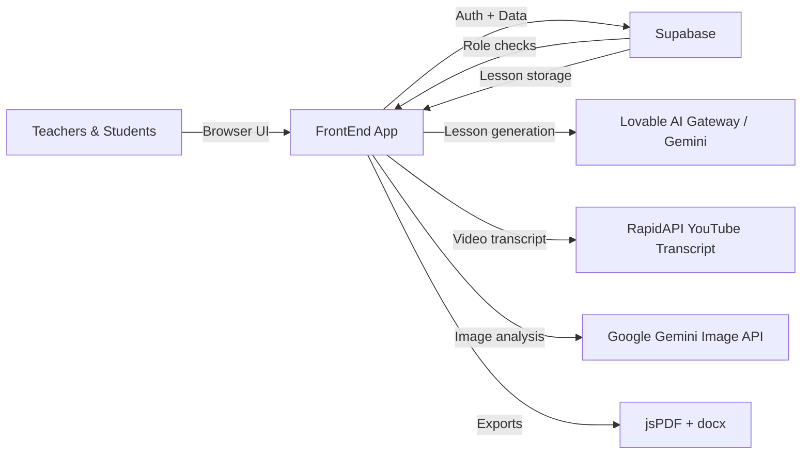
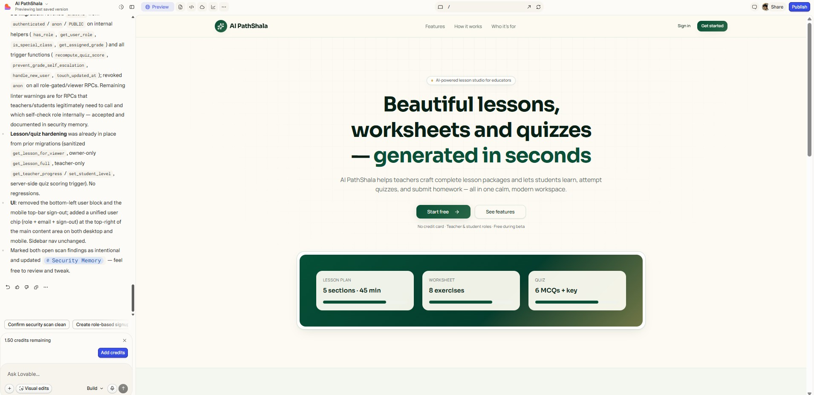
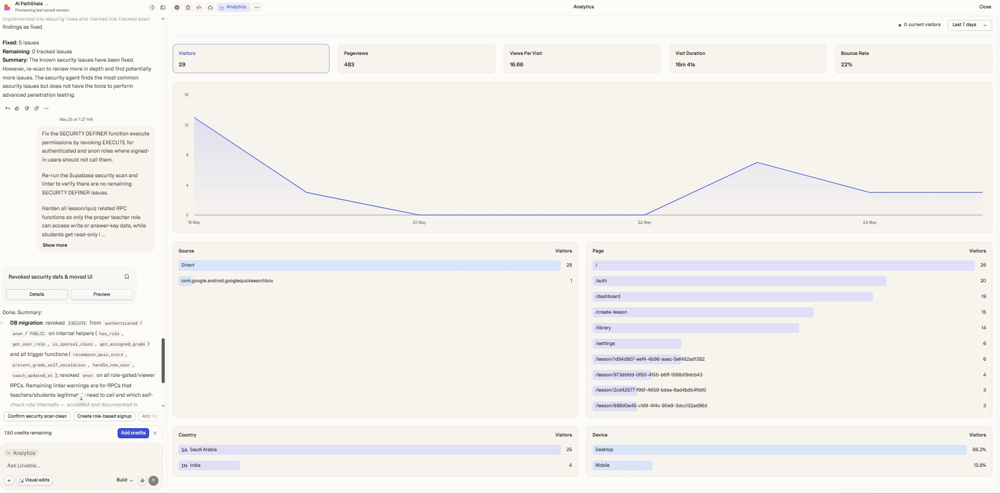
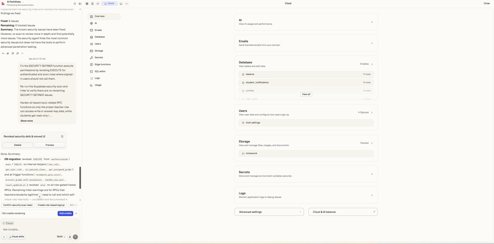
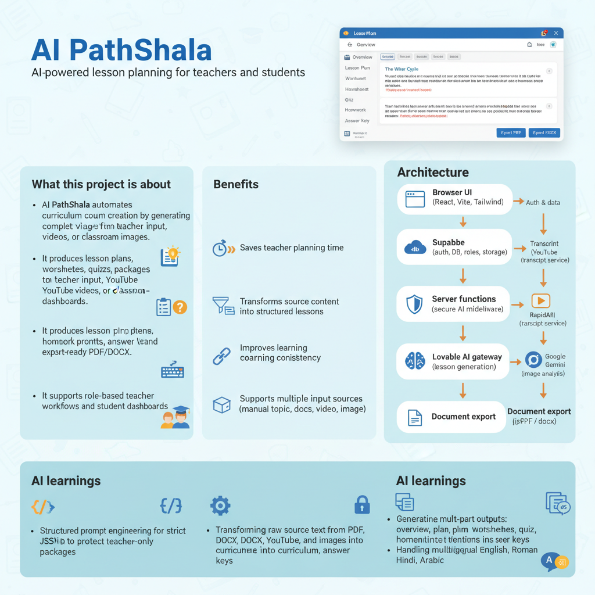
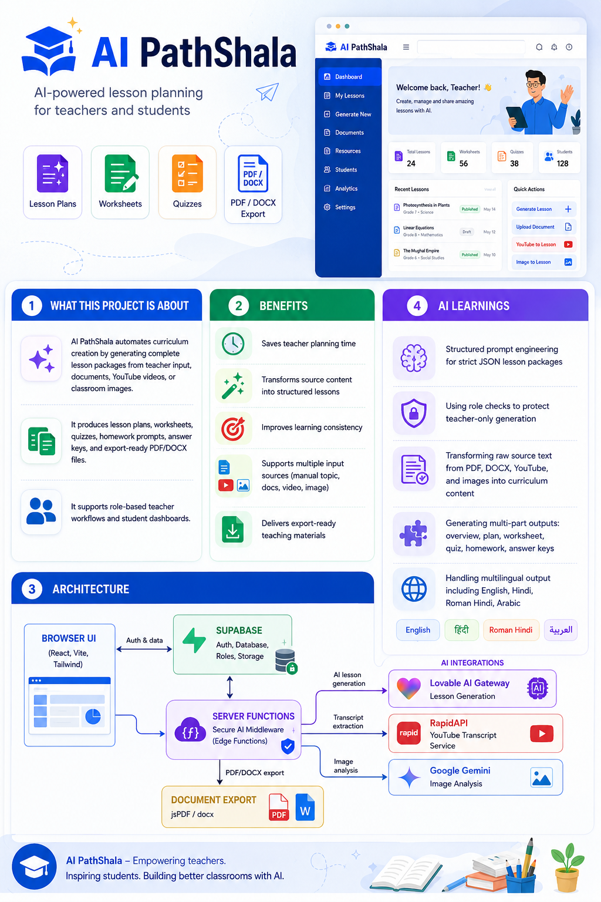

# AI PathShala

> AI PathShala is an AI-powered lesson planning SaaS portfolio project built for teachers and students to generate complete lesson packages, quizzes, worksheets, and exportable learning materials.

---

## 🚀 Product Overview

AI PathShala turns curriculum planning into a fast, guided workflow. Teachers can generate lessons from:
- manual topic inputs
- uploaded PDF/DOCX documents
- YouTube video transcripts
- classroom images

The platform returns structured lesson plans, worksheets, quizzes, homework prompts, answer keys, and export-ready documents.

## 🎯 Problem Solved

Designing lesson plans, worksheets, quizzes, and homework is time consuming for educators. AI PathShala solves this by:
- automating lesson creation
- extracting teaching material from existing sources
- producing student-ready and teacher-ready outputs
- keeping workflows centralized in one SaaS-style application

## 🏗️ Solution Architecture



### Architecture Highlights
- `FrontEnd` is the main SaaS interface built with React, TypeScript, and Vite
- `Supabase` handles authentication, role-based access, lesson storage, and RPC queries
- AI generation is routed through secure server functions for curriculum creation
- Document export is handled client-side with `jsPDF` and `docx`

## ✨ Features

- Teacher / student login with Supabase auth
- Role-based access: teachers generate and manage lessons
- Multi-input lesson generation: text, PDF/DOCX, YouTube, image
- Full AI-generated lesson packages
- Worksheet generation with fill-in-the-blanks, true/false, short and long answers
- Quiz generation with MCQs and rubric-backed answers
- Homework prompts and teacher answer keys
- Lesson library with search, edit, regenerate, delete
- Student dashboard with notifications
- PDF / DOCX export for lessons, quizzes, homework, teacher keys

## 🧠 Workflow Explanation

1. Teacher signs in and opens the dashboard
2. Teacher selects a lesson source: topic, document, YouTube, or image
3. AI backend generates a structured lesson JSON package
4. The lesson is stored in Supabase and added to the teacher library
5. Students can access lessons, take quizzes, and review homework
6. Teachers export lesson plans and reports as PDF or DOCX

## 🛠️ Tech Stack

- Frontend: React, TypeScript, Vite, Tailwind CSS
- Routing: TanStack Router
- Server functions: `@tanstack/react-start`
- Database & auth: Supabase
- AI integrations:
  - Lovable AI gateway for curriculum generation
  - RapidAPI YouTube transcript service
  - Google Gemini image analysis
- Exports: `jsPDF`, `docx`
- UI: Radix UI, Sonner, Lucide icons

## 📦 Installation Steps

```bash
cd FrontEnd
npm install
npm run dev
```

Open the application at `http://localhost:5173`.

## 🔑 Environment Variables

Create a local env file such as `FrontEnd/.env.local` with these values:

```env
SUPABASE_URL="https://your-supabase-project.supabase.co"
VITE_SUPABASE_URL="https://your-supabase-project.supabase.co"
VITE_SUPABASE_PROJECT_ID="your-supabase-project-id"
SUPABASE_PUBLISHABLE_KEY="your-supabase-publishable-key"
VITE_SUPABASE_PUBLISHABLE_KEY="your-supabase-publishable-key"
SUPABASE_SERVICE_ROLE_KEY="your-supabase-service-role-key"
LOVABLE_API_KEY="your-lovable-ai-api-key"
RAPIDAPI_KEY="your-rapidapi-key"
GEMINI_API_KEY="your-google-gemini-api-key"
```

> Use `FrontEnd/.env.example` as a template for safe onboarding.

## 🖼️ Screenshots

| Description | Preview |
| --- | --- |
| Landing / auth flow |  |
| Analytics / dashboard |  |
| Cloud / course workspace |  |
| Project explainer |  |
| Architecture overview |  |

> Add a demo GIF file to `./ScreenShots/ai-pathshala-demo.gif` if you want an animated preview.

## 🌐 Deployment

- Production: `https://ai-pathshala.example.com`
- Preview: `https://ai-pathshala-preview.example.com`

> Update these URLs with your actual deployed project links.

## 🚧 Future Roadmap

- [ ] Add teacher admin onboarding and invite flows
- [ ] Add student quiz scoring and progress analytics
- [ ] Add server-side rendering / PWA support
- [ ] Add real-time collaboration for lesson editing
- [ ] Add multi-language lesson templates and custom branding
- [ ] Add full mobile-responsive dashboard enhancements

## 👨‍🏫 Creator Information

**AI PathShala** was built as a portfolio AI SaaS showcase. It demonstrates modern curriculum automation and teaching workflow design.

- Creator: `Your Name`
- Email: `your.email@example.com`
- Portfolio: `https://yourportfolio.example.com`

## 📄 License

This project is provided under the **MIT License**. See the `LICENSE` file for details.
